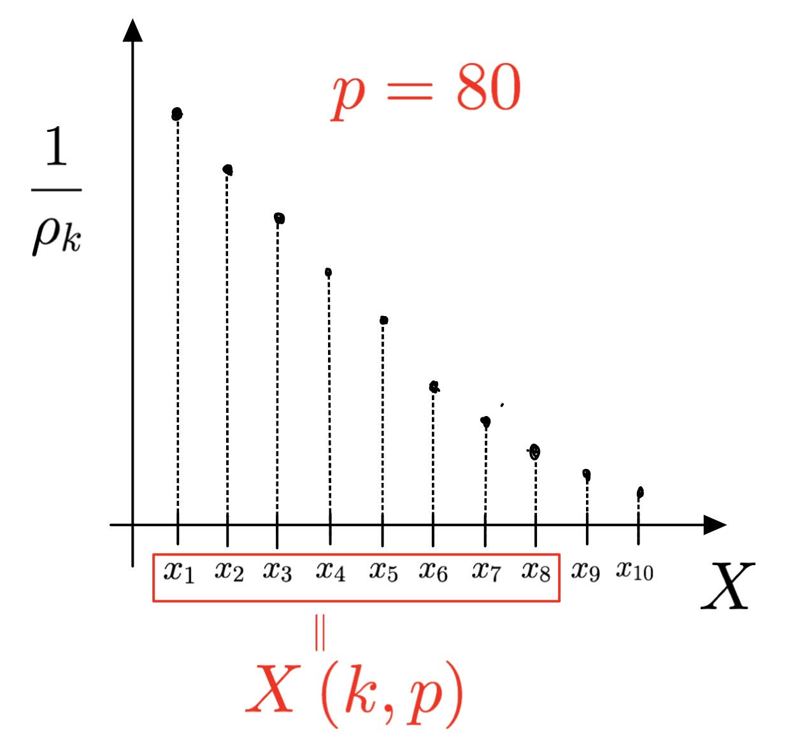
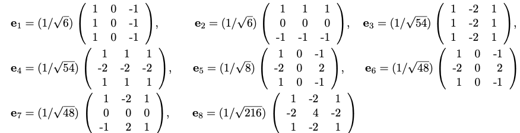
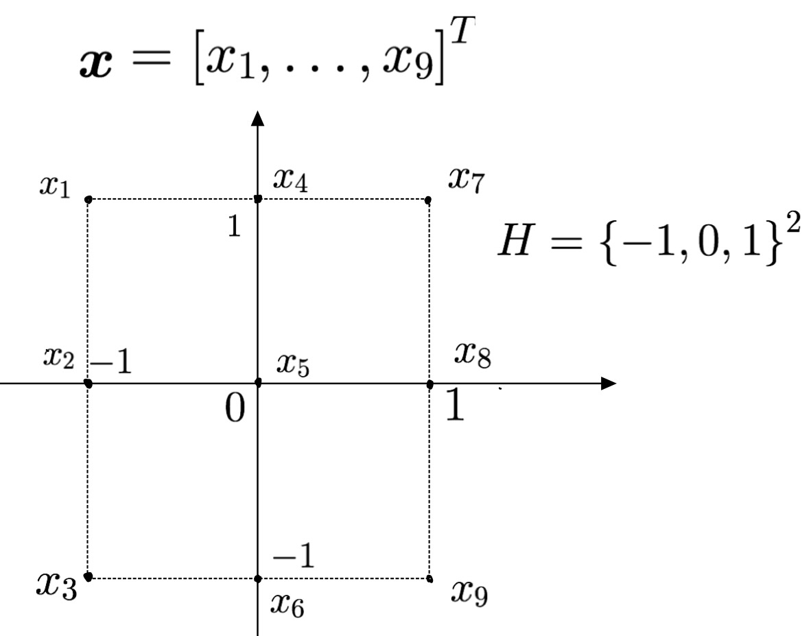

# The summary of HB thesis from chapter 5 to 7

## 0.Preparation

### Definition 0.1 単体写像が定める連続写像

$\phi:K \longrightarrow L$を単体写像とする.この時,多面体 $|K|, |L|$ の間の連続写像$ \bar \phi: |K| \longright
arrow |L|$を次のように定義する.; $\sigma = |a_0, \cdots, a_k| \in K$とその点$x \in \sigma$に対して$x = \lambda_0 a_0 +  \cdots +  \lambda_k a_k (\sum_{i = 0}^{k} \lambda_i = 1, \ \lambda_i \geq 0 ( i = 1, \cdots, k))$なら
$$\bar \phi (x) := \lambda_0 \phi(a_0) + \cdots + \lambda_k \phi(a_k)$$
集合$\{\phi(a_0), \cdots, \phi(a_k)\}$は$L$の単体の頂点集合であり,$\sum_{i = 0}^{k} \lambda_i  = 1, \ \lambda_i \geq 0 ( i = 1, \cdots, k)$であるから,$\bar \phi(x)$は確かに$L$の単体の点となっている.$\bar \phi$を **$\phi$が定める連続写像という**.

### Example 0.2

$K \subset L$となる二つの単体複体に対しては,単体写像として包含写像$\iota:K \longrightarrow L$を取ることができるが,同時に多面体としても$|K| \subset |L|$を満たす.$\bar \iota (x) = x$であるから,$\bar \iota$は多面体の間の包含写像である.

以下では鎖群は$\mathbb{Z}_2$係数であるとする.

### Definition 0. 3 鎖準同型

二つの単体複体$K, L$に対する鎖群$C_q(K), C_q(L) (q \in \mathbb{Z})$の間に準同型写像の族$f_q: C_q(K) \longrightarrow C_q(L) (q \in \mathbb{Z})$が存在して
$$f_{q - 1} \circ \partial_q =\partial_{q}' \circ f_q $$
を満たすとき,$\{f_q\}_{q \in \mathbb{Z}}$を**鎖準同型**という.\
ただしここで$\partial_q$は$K$の$q$次の境界準同型を,$\partial_{q}'$は$L$の$q$次の境界準同型を表している.

### Example 0.4

単体写像$\phi: K  \longrightarrow L$に対して写像$\hat \phi_q: C_q(K) \longrightarrow C_q(L) (q \in \mathbb{Z})$を,$0 \leq q \leq \dim K$に対しては
$$\hat \phi_q (\langle a_0, \cdots, a_q \rangle ) = \begin{cases} \langle \phi(a_0) ,\cdots, \phi(a_q) \rangle & \# \{\phi(a_0) ,\cdots, \phi(a_q)\} = q \\ \boldsymbol{0} & else \end{cases}$$
を満たす準同型として,それ以外の$q \in \mathbb{Z}$に対しては$\boldsymbol{0}$と定義する.この時$\{\hat \phi_q\}$は鎖準同型となる.\
$Proof)q \leq 0$の時と$q > \dim K$の時は明らかに求める等式は成り立つ.よって$\hat \phi_{q - 1}(\partial_q(\langle a_0, \cdots,a_q\rangle)) =\partial_{q}'(\hat \phi_q (\langle a_0, \cdots,a_q\rangle))$を任意の$0 \leq q \leq \dim K$に対して示せば良い.\
$case 1;$
頂点$\phi(a_0) ,\cdots, \phi(a_q)$の内で同じものがあるとし,それを$\phi(a_i) = \phi(a_j) ( i < j)$とする.このとき$\hat \phi_q(\langle a_0, \cdots,a_q\rangle) = \boldsymbol{0}$だから右辺は$\boldsymbol{0}$になる.左辺は
$$\hat \phi_{q - 1} (\partial_q(\langle a_0, \cdots,a_q\rangle)) = \sum_{k = 0}^{q}\hat \phi_{q - 1}(\langle a_0, \cdots, a_{k - 1}, a_{k + 1}, \cdots, a_q\rangle )$$
において$k \ne i, j$の時は$\phi(a_i) = \phi(a_j)$より,$\hat \phi_q(\langle a_0, \cdots, a_{k - 1}, a_{k + 1}, \cdots, a_q\rangle ) = 0$であり,$k = i, j$の項だけが残る.$(i, j)$以外の組$(s, t)$で$\phi(a_s) = \phi(a_t)$となるものがあれば$i$の項も$j$の項も両方とも$0$になる.そのような組がないなら最終的に
$$\hat \phi_{q - 1} (\partial_q(\langle a_0, \cdots,a_q\rangle)) = \langle \phi(a_0), \cdots, \phi(a_{i - 1}), \phi(a_{i + 1}), \cdots, \phi(a_q) \rangle + \langle \phi(a_0), \cdots, \phi(a_{j - 1}), \phi(a_{j + 1}), \cdots, \phi(a_q) \rangle$$
となるが$\phi(a_i) = \phi(a_j) ( i < j)$より,この二つの項は一致している. 従って結局左辺も$0$となって求める等式が成り立つ.\
$case 2$;頂点$\phi(a_0) ,\cdots, \phi(a_q)$が全て異なる時は
$$\hat \phi_{q - 1} (\partial_q(\langle a_0, \cdots,a_q\rangle)) = \sum_{k = 0}^{q}\hat \phi_{q - 1}(\langle a_0, \cdots, a_{k - 1}, a_{k + 1}, \cdots, a_q\rangle ) \\ =  \sum_{k = 0}^{q}\langle \phi(a_0), \cdots, \phi(a_{k - 1}), \phi(a_{k + 1}), \cdots, \phi(a_q) \rangle \\ = \partial_q'(\langle \phi(a_0), \cdots, \phi(a_q) \rangle ) \\ = \partial_q'(\hat \phi_q (\langle a_0, \cdots, a_q \rangle ))$$
と計算できる.よってこの時も求める等式が成り立つ.\
以上のことから$\{\hat \phi_q\}$は鎖準同型である.$\square$

### Definition 0.5 鎖準同型から定まるホモロジー群の準同型

$f_q: C_q(K) \longrightarrow C_q(L) (q \in \mathbb{Z})$を鎖準同型とする.$z \in \ker \partial_q$とするとき,$\partial_q'(f_q(z)) = f_{q - 1}(\partial_q(z)) = f_{q - 1}(\boldsymbol{0}) = \boldsymbol{0}$となるから
$$z \in \ker \partial_q  \Longrightarrow f_q(z) \in \ker \partial_q' $$
が任意の$q \in \mathbb{Z}$で成り立つ.\
また$z,z' \in \ker \partial_q $がホモローグ,つまり$z - z' \in Im \ \partial_{q + 1}$であるとする.この時$f_q (z) - f_q(z') \in f_q(Im \ \partial_{q + 1})$となるが $f_q(Im \ \partial_{q + 1}) = Im \ f_q \circ \partial_{q + 1}  = Im \ \partial_{q + 1}' \circ f_{q + 1}  = \partial_{q + 1}'(Im \ f_{q + 1}) \subset Im \ \partial_{q + 1}'$ であるから
$$z - z' \in Im \ \partial_q \Longrightarrow f_q(z) - f_q(z') \in Im \ \partial_{q + 1}'$$
が任意の$q \in \mathbb{Z}$で成り立つ.\
以上の結果から,ホモロジー群の間の準同型写像$(f_q)_* : H_q(K) \longrightarrow H_q(K)$が
$$(f_q)_* ([z]) := [f_q(z)]$$
で矛盾なく定義される.準同型$\{(f_q)_*\}$を**鎖準同型$\{f_q\}$から定まるホモロジー群の準同型**という.

### Example 0.6

Example 0.4 の鎖準同型$\{\hat \phi_q\}$から定まるホモロジー群の準同型$\{(\hat \phi_q)_*\}$を, **単体写像$\phi$から定まるホモロジー群の準同型** という.

### Definition 0.7 双対鎖準同型

鎖準同型$f_q:C_q(K) \longrightarrow C_q(L)$に対して,双対鎖群の間の準同型$f_q^{\#}: C^q(L) \longrightarrow C^q(K)$を以下で定義する.
$$f_q^{\#}(c) := c \circ f_q \ \ (c \in C^q(L) )$$
$\{f_q^{\#}\}$を$\{f_q\}$から引き起こされた双対鎖準同型という.

### Proposition 0.8

$\delta_q, \delta_q'$をそれぞれ$C^q(K), C^q(L)$の双対境界準同型とする.この時Definition 0.7 の双対鎖準同型は以下の性質を持つ.
$$(i) \delta_q \circ f_q^\# = f_{q + 1}^{\#} \circ \delta_q ' \\ (ii) z \in \ker \delta_q ' \Longrightarrow f_q^\#(z) \in \ker \delta_q \\ (iii) z - z' \in Im \ \delta_q' (z,z' \in \ker  \delta_{q + 1}) \Longrightarrow f_{q + 1}^{\#}(z) - f_{q + 1}^{\#}(z') \in Im \ \delta_q$$
$Proof)(i);\partial_q, \partial_q'$をそれぞれ鎖群$C_q(K), C_q(L)$の境界準同型$c \in C^q(L)$ とする. $\delta_q(f_q^\# (c)) = f_q^\# (c) \circ \partial_{q + 1} = (c \circ f_q) \circ \partial_{q + 1} = c \circ (f_q \circ \partial_{q + 1})$ここで鎖準同型の性質$f_q \circ \partial_{q + 1} = \partial_{q + 1}' \circ f_{q + 1}$を用いることで$c \circ (f_q \circ \partial_{q + 1}) = c \circ (\partial_{q + 1}' \circ f_{q + 1}) = (c \circ \partial_{q + 1}') \circ f_{q + 1} = f_{q + 1}^\# (c \circ \partial_{q + 1}') = f_{q + 1}^\# (\delta_{q}'(c))$がわかる.従って$\delta_q(f_q^\# (c)) = f_{q + 1}^\# (\delta_{q}'(c))$となるから$(i)$が成り立つ.
$(ii);z \in \ker \delta_q'$とすると$(i)$より$\delta_q(f_q^{\#}(z)) = f_{q + 1}^{\#}( \delta_q '(z))) = f_{q + 1}^{\#}(\boldsymbol{0}) = \boldsymbol{0}$.よって$f_q^\#(z) \in \ker \delta_q$がわかる.\
$(iii); z - z' \in Im \ \delta_q' (z,z' \in \ker  \delta_{q + 1})$であるとする.$f_{q + 1}^{\#}(z) - f_{q + 1}^{\#}(z) = f_{q + 1}^{\#}(z - z')\in f_{q + 1}^{\#}(Im \ \delta_q') $であるが,$(i)$によって$f_{q + 1}^{\#}(Im \ \delta_q') = Im \ f_{q + 1}^{\#} \circ \delta_q' = Im \ \delta_q \circ \ f_{q}^{\#} = \delta_q(Im \ f_{q + 1}^{\#})\subset Im \ \delta_q$となるから結果的に$f_{q + 1}^{\#}(z) - f_{q + 1}^{\#}(z') \in Im \ \delta_q$が成り立つ.$\square$

### Definition 0.9 双対鎖準同型から定まるコホモロジー群の準同型

Proposition 0.8の$(ii), (iii)$により双対鎖準同型$f_{q}^{\#}:C^q(L) \longrightarrow C^q(K)$はコホモロジー類を保つことがわかる.従ってコホモロジー群の間の準同型$f_q^*:H^q(L) \longrightarrow H^q(K)$が
$$f_q^*([z]) := [f_q^{\#}(z)]$$
で矛盾なく定義される.$\{f_q^*\}$を**双対鎖準同型$\{f^{\#}_q\}$から定まるコホモロジー群の準同型**という.

### Example 0.10

Example 0.4によって単体写像$\phi: K \longrightarrow L$から鎖準同型$\hat \phi_q$を定義したが,$\hat \phi_q$の双対鎖準同型から定まるコホモロジー群の準同型$\hat \phi_q^{*}:H^q(L) \longrightarrow H^q(K)$を,**単体写像$\phi: K \longrightarrow L$から誘導されるコホモロジー群の準同型**と言い,単に$\phi_q^{*}:H^q(L) \longrightarrow H^q(K)$あるいは$\phi^*:H^q(L) \longrightarrow H^q(K)$とも書く.

以降では,鎖群の元を$c$と表し,特に境界準同型の核の元を表すのに$z$を用いる.双対鎖群の元は特に断りが無い場合は$f$と表すことにする.

### Definition 0.11 相対ホモロジー群

$K$を複体として$L \subset K$を部分複体とする.このとき鎖群$C_q(K),C_q(L)$は$C_q(L) \subset C_q(K)$を満たす.そこで$q$次元相対鎖群$C_q(K, L)$を
$$C_q(K, L) := C_q(K) / C_q(L)$$
とおく.
$\partial_q: C_q(K) \longrightarrow C_{q - 1}(K)$を境界準同型とすると$\partial_q(C_q(L)) \subset C_{q - 1}(L)$であるから
$$c - c' \in C_q(L) (c , c' \in C_q(K)) \Longrightarrow \partial_q(c) - \partial(c') \in C_{q - 1}(L)$$
が成り立つ.従って相対鎖群の間の境界準同型$\partial_q^*:C_q(K, L) \longrightarrow C_{q - 1}(K, L)$が
$$\partial_q^*([c]) := [\partial_q(c)]$$
として矛盾なく定義される.\
$\partial_{q + 1} \circ \partial_q = \boldsymbol{0}$より$\partial_{q + 1}^* \circ \partial_q^*= \boldsymbol{0}$であるから,鎖群のときと同様に
$$Im \partial_{q + 1}^*\subset  \ker  \partial_q^* $$
が成り立つ.
$$H_q(K, L) : = \ker  \partial_q^*/Im \partial_{q + 1}^*$$
としたものを **$q$次元相対ホモロジー群** という.
今,$\pi_p:C_p(K) \longrightarrow C_p(K, L)$を標準的な射影とすると$\partial_q^*$の定義から
$$\partial^*_q \circ \pi_q = \pi_{q - 1} \circ \partial_q$$
が成り立つ.つまり$\{\pi_q\}$は二つの鎖群$C_q(K)$と$C_q(K, L)$の間の鎖準同型となる.従って$\{\pi_q\}$はホモロジー群の間の準同型
$$(\pi_q)_*:H_q(K) \longrightarrow H_q(K, L)$$
とコホモロジー群の間の準同型
$$(\pi_q)^*:H^q(K, L) \longrightarrow H^q(K)$$
を誘導する.ここで$(\pi_q)_*([z]) = [\pi_q(z)]$であり,$(\pi_q)^*([f]) = [ f \circ \pi_q]$である.

### Definition 0.12 相対コホモロジー群

相対鎖群$C_q(K, L)$から$\mathbb{Z_2}$への準同型写像全体の集合を$C^q(K, L)$と書く.$\partial_q^*:C_q(K, L) \longrightarrow C_{q - 1}(K, L)$を相対鎖群の境界準同型とするとき,その双対境界準同型$\delta_q^*:C^q(K, L) \longrightarrow C^{q + 1}(K, L)$を
$$\delta_q^*(f) : = f \circ \partial_{q + 1}^* \ \ \ (f \in C^q(K, L))$$
で定義する.$\partial_q^*\circ \partial_{q + 1}^* = \boldsymbol{0}$であるから,$\delta_{q} ^* \circ \delta_{q - 1}^*= \boldsymbol{0}$である.つまり
$$Im \ \delta_{q - 1}^* \subset \ker  \delta_{q}^*$$
が成り立つ.そこで相対コホモロジー群$H^q(K, L)$を
$$H^q(K, L) := \ker  \delta_{q}^*/ Im \delta_{q - 1}^*$$
で定義する.

### Theorem 0.13

相対コホモロジー群$H^q(K, L)$は相対ホモロジー群の双対$\hom(H_q(K, L), \mathbb{Z}_2)$と同型である.

$proof)$二つの準同型$\phi:H^q(K, L) \longrightarrow \hom(H_q(K, L), \mathbb{Z}_2)$と$\psi:\hom(H_q(K, L), \mathbb{Z}_2)\longrightarrow H^q(K, L)$を構成して$\psi \circ \phi$と$\phi \circ \psi$が共に恒等写像であることを示す.

- $\phi$の構成
コホモロジー類$[f] \in H^q(K, L)$に対して$\phi([f]) \in \hom(H_q(K, L), \mathbb{Z}_2)$を次で定義する.
$$\phi([f])([z]) :=  f(z)$$
この$\phi([f])$は見かけ上代表元の取り方に依存しているため,$\phi([f])$がホモロジー群から$\mathbb{Z}_2$への写像として矛盾なく定義されるには,
$$f \sim g , z \sim z' \ (f, g \in \ker  \delta_{q}^*, z, z' \in \ker  \partial_q^*) \Longrightarrow f(z) = g(z')$$
となることを確認する必要がある.ところがこれは,それぞれの同値関係の定義から$f - g = \delta_{q - 1}^* (h), z - z' = \partial_{q + 1}^*(c) \ (h \in C^{q - 1} (K, L), c \in C_{q + 1}(K, L))$とおくと
$$f(z) - g(z') = (f(z) - g(z)) +( g(z) - g(z')) \\ = (f - g)(z) + g(z - z') \\ = \delta_{q - 1}^* (h)(z) + g(\partial_{q + 1}^*(c)) \\ = h(\partial_q^*(z)) + \delta_q^*(g)(c) \\ = \boldsymbol{0}$$
が得られることから明らかである.従って$\phi([f])$は$f$の同値類によってのみ決定される写像$\phi([f]):H_q(K, L) \longrightarrow \mathbb{Z}_2$であり,定義から明らかに$[z] \in H_q(K, L)$に関して準同型であるから$\phi([f]) \in \hom(H_q(K, L), \mathbb{Z}_2)$が確かにわかる.また
$$\phi([f + g]) = \phi([f]) + \phi([g])$$
であることも$\phi([f])$の定義から確認できる.\
以上によって準同型写像$\phi:H^q(K, L) \longrightarrow \hom(H_q(K, L), \mathbb{Z}_2)$が構成された.
- $\psi$の構成
$C_q(K, L)$はベクトル空間であるから,ある部分空間$W$によって
$$C_q(K, L) = \ker  \partial_q^* \oplus W$$
と直和分解できる.ここで$W$は境界$\partial_q^*:C_q(K, L) \longrightarrow C_{q - 1}(K, L)$に準同型定理を適用することで同型写像
$$\eta :W \ni w \mapsto \eta(w) = \partial_q^*(w) \in  Im \partial_q^*$$
を得る.そこで$F \in \hom(H_q(K, L), \mathbb{Z}_2)$に対して,写像$h_F:C_q(K, L) \longrightarrow \mathbb{Z}_2$を,$c = z + w \in C_q(K, L) \ (z \in \ker  \partial_q^*, w \in W)$に対して
$$ h_F(c) := F([z])$$
と定義する.$h_F$は$c \in C_q(K, L)$に関して準同型であるから$h_F \in C^q(K, L)$であり,特に$c \in C_{q + 1}(K, L)$とすると$\partial_{q + 1}^*(c) \in \ker \partial_q^*$と$[\partial_{q + 1}^*(c)] = \boldsymbol{0}$より
$$\delta_q^*(h_F)(c) = h_F (\partial_{q +1}^*(c)) = F([\partial_{q +1}^*(c)]) = F(\boldsymbol{0}) = \boldsymbol{0}$$
となるから$\delta_q^*(h_F) = \boldsymbol{0}$つまり$h_F \in \ker \delta_q^*$となる.そこで目的の写像$\psi:\hom(H_q(K, L), \mathbb{Z}_2)\longrightarrow H^q(K, L)$を
$$\psi(F) := [h_F]$$
で定義する.$h_F$の定義から明らかに$\psi$は$F \in \hom(H_q(K, L), \mathbb{Z}_2)$に関して準同型である.
- $\psi \circ \phi$が恒等写像であること
$[f] \in H^q(K, L)$とする.$\psi \circ \phi ([f]) = [h_{\phi([f])}]$に注意すると,$f \sim h_{\phi([f])}$を示せば良い.$c = z + w \in C_q(K, L) \ (z \in \ker  \partial_q^*, w \in W)$とすると
$$f(c) - h_{\phi([f])}(c) = f(c) - \phi([f])([z]) \\ = f(c) - f(z) \\ = f(c - z) \\ = f(w) \\ = f \circ \eta^{-1} \circ \eta(w) \\ = f \circ \eta^{-1}(\partial_q^*(w)) \ \ (\because \eta(w) = \partial_q^*(w)) \\ = f \circ \eta^{-1}(\partial_q^*(c)) \ \ (\because \partial_q^*(c) = \partial_q^*(w)) \\ = f^*(\partial_q^*(c)) \ \ (\because f^*|_{Im \partial_q^*} = f \circ \eta^{-1}) \\ =\delta_{q - 1}^*(f^*)(c)$$
従って$f - h_{\phi([f])} = \delta_q^*(f^*)$となる.ただし,ここで準同型$f^*:C_{q - 1}(K, L) \longrightarrow \mathbb{Z}_2$は,準同型$f \circ \eta^{-1}:Im \partial_q^* \longrightarrow \mathbb{Z}_2$を直和分解$C_q(K, L) = Im \partial_q^*\oplus V$に対して,$f^*|_{Im \partial_q^*} = f \circ \eta^{-1}, f^*(V) = \boldsymbol{0}$と拡張したものとしている.\
以上の式変形によって$f \sim h_{\phi([f])}$が成り立つ.

- $\phi \circ \psi$が恒等写像であること
$F \in \hom(H_q(K, L), \mathbb{Z}_2)$とする.$\phi \circ \psi(F) = \phi([h_F])$より$\phi([h_F]) = F$を示せば良い.$[z] \in H_q(K, L)$に対して$\phi([h_F])([z]) = h_F(z) = F([z])$だから確かに$\phi([h_F]) = F$が成り立つ.

以上の議論から題意が示された.$\square$

### Definition 0.14 相対コホモロジーの元と積

以下では$H^q(K) = \hom(H_q(K), \mathbb{Z}_2),H^q(K, L) = \hom(H_q(K, L), \mathbb{Z}_2)$と見做す.この意味でコホモロジー類を$[f]$ではなく単純に$f$と書くことにする.
$f \in H^p(K, L)$ $g \in H^q(K)$とすると$f \circ (\pi_q)_*\in H^p(K)$であるから,カップ積$f \smile g \in H^{p + q}(K, L)$を
$$f \smile g := (f \circ (\pi_p)_* ) \smile g) \circ (\pi_{p + q})_*$$
で定義する.ただし,右辺のカップ積は通常のコホモロジー群$H^q(K)$でのカップ積である.また,$[z] \in H_{p + q}(K, L)$とのキャップ積を$f \in H^p(K, L)$のときは
$$ h([z] \frown f) := f \smile h([z]) \ \ \forall h \in H^q(K)$$
となる$[z] \frown f \in H_q(K)$として定義する.
$f \in H^p(K)$のときは
$$ h([z] \frown f) := h \smile f([z]) \ \ \forall h \in H^q(K, L)$$
なる$[z] \frown f \in H_q(K, L)$とする.

### Definition 0.15 境界を持つ多様体

上半空間$\mathbb{H}^n:= \{(x_1, \cdots, x_n) \in \mathbb{R}^n | x_n \geq 0\}$を$\mathbb{R}^n$の部分位相空間とみなす.
$M$が **$n$次元境界付き位相多様体** であるとは,第二可算公理を満たすハウスドルフ空間であって, $M$の各点が上半空間のある開集合と同相になるような開近傍を持つことをいう.\
$p \in M$の開近傍$U$から,$\mathbb{H}^n$の開集合$V$への同相写像を$\phi : U \longrightarrow V$とするとき,対$(U, \phi)$を$p$の**チャート**という.\
また$p \in M$が$M$の**境界点**であるとは,$p$のあるチャート$(U, \phi)$で$\phi(p)$の第$n$成分が$0$であるものが存在することをいう.$M$の境界点全体を$\partial M$と書く.

### Theorem 0.16 Lefschetz双対

$M$を境界をもつ$n$次元ホモロジー多様体とする.$[M]_2 \in H_n(M, \partial M)$を基本ホモロジー類とするとき,これとのキャップ積で与えられる二つの写像は同型である.
$$\phi:H^k(M, \partial M) \ni [z] \longrightarrow [M]_2 \frown [z] \in H_{n - k}(M) \\ \psi: H^{n - k}(M) \ni [z] \longrightarrow [M]_2 \frown [z] \in H_{k}(M, \partial M) $$

## Chapter 5

位相空間のフィルトレーション
$$\emptyset = X_0 \subset X_1 \subset \cdots \subset X_n = X$$
を近似する単体複体のフィルトレーション
$$\emptyset = K_0 \subset K_1 \subset \cdots \subset K_n = K$$
を考える.包含写像$\psi_{j, i}: K_i \longrightarrow K_{j} \ (i \leq j)$はホモロジー群の間の準同型
$$(\psi_{j, i})_*:H_q(K_i) \longrightarrow H_q(K_j)$$
とホモロジー群の間の準同型
$$(\psi_{j, i})^*:H^q(K_j) \longrightarrow H^q(K_i)$$
を誘導する.
特に$i = j+ 1, j = 0, \cdots , n$まで考えることでホモロジー群の系列

$$\boldsymbol{0} = H_q(K_0) \longrightarrow H_q(K_1) \longrightarrow \cdots \longrightarrow H_q(K_n)$$
とコホモロジー群の系列
$$\boldsymbol{0} = H^q(K_0) \longleftarrow H^q(K_1) \longleftarrow \cdots \longleftarrow H^q(K_n)$$
を得る.

### Definition 5.1

上記のホモロジー群の系列を**パーシステントホモロジー**といい,コホモロジー群の系列を**パーシステントコホモロジー**という.

### Definition 5.2

$q$次元のホモロジー類$\gamma$が$K_i$で**誕生する**とは$\gamma \in H_q(K_i) - Im \ (\psi_{i, i - 1})_*$を満たすことであり,それが$K_j$で**消滅する**とは$j = \min \{0 \leq k \leq n| (\psi_{k,k - 1})_*(\gamma) = \boldsymbol{0} \}$を満たすことである.またこのとき区間
$$I = [i, \ j)$$
は$\gamma$の存続する区間を表す.これを**パーシステント区間**という.ただし,$\gamma$が$K_n$でも消滅しない場合は$j = \infty$とおくことにする.パーシステント区間が有界である場合,
$$pers(\gamma) = j - i$$
は$\gamma$の存続する期間を表している.これを$\gamma$の$persistence$と呼ぶことにする.

### Definition 5.3

$q$次元のコホモロジー類 $\Gamma$ が $K_j$ で**誕生する**とは$\Gamma \in H^q(K_j) - Im \ (\psi_{j+ 1, j})^*$を満たすことであり,それが$K_i$で**消滅する**とは$i = \max \{k| \exists \Lambda \in H^q(K_{j + 1})\ s.t. \  (\psi_{j + 1, k})^*(\Lambda) = \psi_{j, k}^q(\Gamma) \}$を満たすことである.またこの時$copers (\Gamma) = j - i$を$\Gamma$の$co persistence $という.

## Chapter 6

フィルトレーション
$$\emptyset = X_0 \subset X_1 \subset \cdots \subset X_n = X$$
の各$X_i$が弧状連結な$n$次元ホモロジー多様体であると仮定し,$\partial X_i$をDefinition0.15の意味での境界とする.このときパーシステントホモロジー
$$\boldsymbol{0} = H_q(X_0) \longrightarrow H_q(X_1) \longrightarrow \cdots \longrightarrow H_q(X_n)$$
の次元$q$が大きい場合に,低次元のフィルトレーションに変換する方法を考える.
まず,このパーシステントホモロジーの双対として,$H_q(X)$と同型な$H^q(X)$によって,パーシステントコホモロジー
$$\boldsymbol{0} = H^q(X_0) \longleftarrow H^q(X_1) \longleftarrow \cdots \longleftarrow H^q(X_n)$$
が得られる.このときTheorem 0.14より$H^q(X_i)$は$H_{n - q}(X_i,\partial X_i)$に同型である.従って上記のパーシステントコホモロジーにLefschetz双対を適用することで相対ホモロジーの系列
$$\boldsymbol{0} = H_{n - q}(X_0, \partial X_0) \longrightarrow H_{n - q} (X_1, \partial X_1) \longrightarrow \cdots \longrightarrow H_{n - q}(X_n, \partial X_n) = H_{n - q}(X, \partial X)$$
を得る.ただし,この系列の間の写像は？

## Chapter7

与えられたコホモロジー類に対して,それがいつカップ積によって分解可能であるかを示すためのアルゴリズムを考える.そしてこれをパーシステントコホモロジーにおいても拡張する.

### Definition 18

コホモロジー類$\beta \in H^{p + q}(X)$が分解可能(*decomposable*)であるとは, ある$f \in H^p(X)$と$g \in H^q(X)$が存在して$\beta = f \smile g$となることを言う.

### Decomposability Algorithm

単体複体のフィルとレーション
$$\emptyset = K_0 \subset K_1 \subset \cdots \subset K_n = K_{n + 1} = \cdots = K$$
であって,$K_i = K_{i - 1} \cup \lambda_i$となるものを考える.ここで$\lambda_i$は単体(の全ての辺単体からなる複体)とする.
今,対応するパーシステントコホモロジー
$$\boldsymbol{0} = H^*(K_0) \longleftarrow H^*(K_1) \longleftarrow \cdots \longleftarrow H^*(K_n)$$
において,分解可能なコホモロジー類はいつ,どこで生まれるのかを判別するアルゴリズムを考える.
まず$p$次元コホモロジー類$[x]$が$K_s(s > n)$で誕生し,$K_t(t < n- 1)$で消滅すると仮定し,$x = \sigma_1^* + \cdots + \sigma_n^*$と表されているとする.さらに$\Delta$を$p + q$次元単体としたとき$K_n = K_{n - 1} \cup \Delta$であり,$\Delta^* = \delta(y)$となる$y \in C^{ p + q - 1}$が存在したと仮定する.
このとき$K_{n - 1}$においては$\delta(y) = \boldsymbol{0}$となるから$K_{n - 1}$において$y$はコサイクルである.$y$を$p + q - 1$次元の単体で$y = \tau_1^* + \cdots + \tau_m^*$と表したとき,$CoIncidenceMatrix- D(y)$を次のように定義する;$\tau_1, \cdots, \tau_m$

## 圏論についてのおさらい

### 1.1圏

圏(category)$\mathcal{A}$は以下のものから構成される.

- 対象(object)と呼ばれるものの集まり$ob(\mathcal{A})$
- 各対象$A, B \in ob(\mathcal{A})$の間の射(morphism, map)の集まり$\mathcal{A}(A, B)$
- 各対象$A, B, C \in ob(\mathcal{A})$に対して,合成(composition)と呼ばれる関数$\circ$
$$\mathcal{A}(A, B) \times \mathcal{A}(B, C) \longrightarrow \mathcal{A}(A, C) \\ (f, g) \longmapsto g \circ f$$
そしてさらにそれは以下の結合法則を満たす;\
任意の$f \in \mathcal{A}(A, B), g \in \mathcal{A}(B, C), h \in \mathcal{A}(C, D)$に対して
$$h \circ (g \circ f) = (h \circ g) \circ f$$
- 各対象$A \in ob(\mathcal{A})$に対して恒等射(identity)と呼ばれる射$1_A \in \mathcal{A}$\
そしてさらにそれは以下の単位法則を満たす;
任意の射$f \in \mathcal{A}(A, B)$に対して
$$f \circ 1_A = f =  1_B \circ f$$

### 1.2圏の例

- 位相空間を対象とし,連続写像を射とする圏$\mathbf{Top}$
- 加群を対象とし,準同型写像を射とする圏$\mathbf{Ab}$

### 1.3 双対圏

圏$\mathcal{A}$の双対圏$\mathcal{A}^*$とは,$ob(\mathcal{A^*}) = ob(\mathcal{A})$とし$\mathcal{A^*}(A, B) = \mathcal{A}(B, A)$とする圏のことである.つまり対象$B$から対象$A$への射$f$を,対象$A$から対象$B$への射として捉え直した圏のことである.なお$\mathcal{A}^*$の合成と各恒等射は$\mathcal{A}$のものと同じである.$f \in \mathcal{A}(B, A)$を$\mathcal{A}^*$の射として捉え直したものを$f^*$と書く.

### 1.4 関手

$\mathcal{A}, \mathcal{B}$を圏とする.関手$F: \mathcal{A} \longrightarrow \mathcal{B}$とは
- $A \mapsto F(A)$と書かれる関数
$$ob(\mathcal{A}) \longrightarrow ob(\mathcal{B})$$
- $A, A' \in ob(\mathcal{A})$について$f \mapsto F(f)$と書かれる関数
$$\mathcal{A}(A, A') \longrightarrow \mathcal{B}(F(A), F(A'))$$
からなり,以下の公理を満たすものである.
- $f \in \mathcal{A}(A, A'), f' \in \mathcal{A}(A', A'') \Longrightarrow F(f' \circ f) = F(f') \circ F(f)$
- $A \in ob(\mathcal{A})$に対して$F(1_A) = 1_{F(A)}$

### 1.5 関手の例

- $n \in \mathbb{Z}_{\geq 0}$に対して,$n$次ホモロジー群を割り当てる関手$H_n: \mathbf{Top} \longrightarrow \mathbf{Ab}$
- $n$次の$G$係数コホモロジーを割り当てる関手$H^n( \ \cdot \ ; G): \mathbf{Top}^* \longrightarrow \mathbf{Ab}$

### 1.6 自然変換

$\mathcal{A}, \mathcal{B}$を圏とし$F,G:\mathcal{A} \longrightarrow \mathcal{B}$を関手とする.自然変換(natural transformation)$\alpha:F \longrightarrow G$とは$\mathcal{B}$の射の族$(\alpha_A : F(A) \longrightarrow G(A))_{A \in \mathcal{A}}$であって,任意の$f \in \mathcal{A}(A, A')$に対して$\alpha_{A'} \circ F(f) = G(f) \circ \alpha_{A}$が成り立つものをいう.

### 1.7 自然変換の例

- コホモロジー作用素
二つのコホモロジー関手の間の自然変換$\theta = (n, m ; G,G'):$$H^n(\ \cdot \ ; G) \longrightarrow H^m(\ \cdot \ ; G')$はコホモロジー作用素と呼ばれる.

## Steenrod Square

### 2.1 Steenrod Square
Steenrod Squareとは以下の公理を満たすコホモロジー作用素である.
$(1)$任意の$i \geq 0, q \geq 0$に対して準同型同型な自然変換
$$Sq^i:H^q(X, A) \longrightarrow H^{q + i}(X, A)$$
が存在する.ここで$H^q(X, A)$は相対コホモロジーを表している.
$(2)$任意の空間対の連続写像$f:(X, X') \longrightarrow (Y, Y')$に対して
$$Sq^i \circ f^* = f^* \circ Sq^i$$
$(3) Sq^0$は恒等写像である.
$(4) x $の次元が$q$であるなら,$Sq^q(x) = x \cup x$
$(5) i$が$x$の次元よりも大きいなら$Sq^i(x) = 0$
$(6)$The Carten formula 
$$Sq^k(\alpha \cup \beta) = \sum_{i + j = k}Sq^i(\alpha)\cup Sq^j(\beta)$$

### 2.2 $cup-n$積
$c \in C^q(K), c' \in C^p(K)$と$0 \leq n \leq p + q$に対して,$m = p + q - n$とするとき,$cup-n$積$c \cup_{n} c \in C^m(K)$を以下で定義する;
- $n$が偶数のとき
$$c \cup_n c'(\langle v_0, \cdots, v_m \rangle) = \sum_{i_n = S(n)}^m \sum_{i_{n - 1} = S(n -1)}^{i_n - 1} \cdots \sum_{i_1 = S(1)}^{i_2 - 1}c(\langle v_0 , \cdots, v_{i_0}, v_{i_1}, \cdots, v_{i_2}v_{i_3}, \cdots, v_{i_{n-2}}, v_{i_{n -1}}, \cdots, v_{i_n}\rangle) \cdot c'(\langle v_{i_0} , \cdots, v_{i_1}, v_{i_2}, \cdots, v_{i_3}v_{i_4}, \cdots, v_{i_{n-1}}, v_{i_n}, \cdots, v_m \rangle)$$

- $n$が奇数のとき
$$c \cup_n c'(\langle v_0, \cdots, v_m \rangle) = \sum_{i_n = S(n)}^m \sum_{i_{n - 1} = S(n -1)}^{i_n - 1} \cdots \sum_{i_1 = S(1)}^{i_2 - 1}c(\langle v_0 , \cdots, v_{i_0}, v_{i_1}, \cdots, v_{i_2}v_{i_3}, \cdots, v_{i_{n-2}}, v_{i_{n -1}}, \cdots, v_{m}\rangle) \cdot c'(\langle v_{i_0} , \cdots, v_{i_1}, v_{i_2}, \cdots, v_{i_3}v_{i_4}, \cdots, v_{i_{n-1}}, v_{i_n}, \cdots, v_m \rangle)$$

ここで$0 \leq k \leq n$に対して
$$S(k) = i_{k+ 1} - i_{k + 2} + \cdots + (- 1)^{k + n - 1}i_{n} + ( - 1)^{k + n} \lfloor \frac{m + 1}{2} \rfloor + \lfloor \frac{k}{2} \rfloor$$
と定義しており,$S(0)= i_0$としている.

コパーシステント、双対性、Ghistの論文,レフしっつ双対はバウンダリ付きのも必要

### Ghrist 

### 研究背景
CarlssonたちによるTDAの特徴量検出や高次元データの形状認識への応用に関する貢献を研究したもの

### 研究概要
TDAにまつわる技術とそのnatural images(自然の背景画像)の分類問題への応用について述べる

### 使用したデータセット
 A collection of 4167 digital photographs of random outdoor scenes

### データの前処理
データセット内の各画像から$3 \times 3$のピクセルのデータを$5000$個ランダムに取得して,その上位20％はコントラストを維持するようにする.
$3 \times 3$のピクセルのデータはグレースケールで$3 \times 3$の行列として表現され,平均強度に関して正規化される.その構成は[18]に乗っている;

まず$9 \times 9$の行列$D = (D_{ij})$を次のように定義する.
$3 \times 3$のピクセルのデータに対数をとって得られた行列$p = (p_{ij})$を9次元ベクトルとして$\boldsymbol{x} = [x_1, x_2 ,..., x_9]^T = [p_{11}, p_{21}, p_{31}, p_{21}, ..., p_{33}]^T$と定義し,
$D_{ii} :=$ 行列表示の時の$x_i$の斜めを含めない隣の成分の個数
$i$でない$j$に対しては
$D_{ij}:= x_j$が行列表示の時に$x_i$の隣なら$-1$, それ以外は$0$

このようにして定めた$D$は正定値対称行列になっている.
そこで$D-norm$を
$$\| \boldsymbol{x}\|_D ^2= \boldsymbol{x}^T D \boldsymbol{x}$$
で定義する.
$D-norm$を用いてデータ$\boldsymbol{x}$を次のように正規化する.
$$\boldsymbol{y} = \frac{(\boldsymbol{x} - \frac{1}{9}\sum_{i}x_i)}{\| \boldsymbol{x} - \frac{1}{9}\sum_{i}x_i \|_D}$$
これによって$\boldsymbol{x}$は
$$\hat S^7 := \{ x \in \mathbb{R}^9 | \boldsymbol{x}^TD\boldsymbol{x} = 1\}$$
上の点$\boldsymbol{y}$に変換される.
座標系の変換を行うために$DCT$(離散コサイン変換)によって行列$D$を対角化するような基底をとる.その基底が[18]の$\boldsymbol{e}_1, \cdots , \boldsymbol{e}_8 \in \mathbb{R}^9$となっている.行列$A=[\boldsymbol{e}_1, ..., \boldsymbol{e}_8]$として,$\Lambda = diag(\frac{1}{\| \boldsymbol{e}_1 \|^2} , \dots, \frac{1}{\| \boldsymbol{e}_8 \|^2})$とすることで線形写像$\boldsymbol{v} = \Lambda A^T \boldsymbol{y}$(あるいは$\boldsymbol{y} = A \boldsymbol{v}$)は$\hat S^7$から$S^7$への変換を与える.これによって元のピクセルデータが$S^7$に射影される.\
なお,二つのピクセルパッチ$P_1, P_2$の距離は$P_i$を$\boldsymbol{y}_i$に変換して$\boldsymbol{v}_i = \Lambda A^T \boldsymbol{y}_i$とするとき
$$dist(P_1, P_2) = \arccos(\boldsymbol{v}_1・\boldsymbol{v}_2)$$
で定義される.

- フィルトレーションの作り方
codensity function $δ_k$: 自然数kを固定する.データセット内の各点データ$\boldsymbol{x}$に対して,$\boldsymbol{x}$から$k$番目に近いデータセット内の点との距離を$δ_k(x)$とする.
$δ_k$はデータセット$M$上の関数となる.
データセットの絞り込み$M[k, T]$:$δ_k$の値が上位$T\%$の$M$内の点全体
フィルトレーション:適切な$k, T$をとって$M[k, T]$からランダムに$5000$個の点をとり,それらの点に対して**witness complex**を計算
    - **Witness Complex**の定義
    Witnes ComplexはWitnessesと呼ばれる有限集合$W \subset \mathbb{R}^D$と,Landmarksと呼ばれる部分集合$L \subset W$の対$(L, W)$から決定される.\
    - $\sigma \subset L$が$w \in W$において弱く目撃されるとは,$\forall l \in \sigma, d(w, l) \leq d(w, L - \sigma)$が成り立つことを言う.
    - $\sigma \subset L$が$w \in W$において強く目撃されるとは,$\forall l \in \sigma, d(w, l) \leq d(w, L)$が成り立つことを言う.\
    ただし,ここで$d$は距離関数で$d(w, L):= \min \{d(w, l') | l' \in L\}$としている.\
    $W$のある点で弱く目撃される$L$の部分集合全体からなる複体を$WC(L, W)$と書いて$(L, W)$から定まるweak Witnes Complexという.強く目撃されるものの全体からなる複体は$SWC(L, W)$と書いてStrong Witness Complexという　

    - **Witness Complexによるフィルトレーション**
    $W, L$の役目はそのまま引き継ぐ.
    - $\sigma \subset L$が$w \in W$において重み$\alpha$で弱く目撃されるとは,$\forall l \in \sigma, d(w, l)^2 \leq d(w, L - \sigma)^2 + \alpha ^2$が成り立つことを言う.\
    - $\sigma \subset L$が$w \in W$において重み$\alpha$で強く目撃されるとは,$\forall l \in \sigma, d(w, l)^2 \leq d(w, L)^2 + \alpha ^2$が成り立つことを言う.\
    $W$のある点において重み$\alpha$で目撃される$L$の部分集合全体からなる複体を,弱い目撃なら$WC_{\alpha}(L, W)$,強い目撃なら$SWC_{\alpha}(L, W)$と書いて$(L, W)$から定まる重み付き(Weak / Strong)Witnes Complexという.
    $SWC$はパーシステントホモロジーの計算で$\alpha$の値が高いときに使うと計算速度が早い上にデータのホモロジーを得ることができる.

- 結果
    - $(k = 300, T = 25の場合)$
    $H_1$を計算すると一つだけ強固な生成元が存在した.($S^7$の1次のホモロジーは0)であるから5000個の点,あるいは$M[300, 25]$は$S^7$内である円の周りに散らばっていることがわかる.
    生成元の特徴を調べてみると,$3 \times 3$のパッチにおいて,明るい部分と暗い部分がパッチ内で線形的に分離されていることがわかった.
    つまりこの生成元(primary circleと呼ぶことにする)は,元々の画像内での明暗の境界部分(明るいピクセルしかないパッチと暗いピクセルしかないパッチの)に当たるパッチを指し示している.さらにパッチ内の分離線をnodal line と呼子ことにすると,primary circle のパッチはそのnodal lineの角度によって円形に配置されていることもわかった.
    (論文内では主要円をnodal curveとも呼んでいる)

    - $(k = 15, T = 25)$
    $H1$には5つの生成元が確認された.一方で[3]の論文における$H_0$の調査と合わせると,低い$k$においては2つの円(secondary circlesと呼ばれている)が得られる.さらにこの二つのsecondary circlesは,primary circleと2回交わっているが,互いには交わりを持たない.[3]によるとsecondary circleは2色のパッチから3色のパッチへの変化を垂直方向に変化させるものと水平方向に変化させるものに分類できる.

    - その他の調査
    [3]:カメラを45度に傾けて撮影を繰り返して得られたデータセットの$H_1$の生成元は水平方向の偏りと垂直方向の偏りを持っていた.さらに$M[100, 10]$においてパーシステントホモロジーを計算したところ,トーラスかクラインの壺のホモロジーを確認することができた[3 figure 9].
    
    図9のようにクラインボトルのデータ空間への埋め込みをすることでprimaly circle とsecondary circle は実現できることがわかる.
    
    
[3] G. Carlsson, T. Ishkhanov, V. de Silva, and A. Zomorodian, “On the local behavior of spaces
of natural images,” preprint, (2006).

## Carlsson

### Introduction

自然画像はグレースケールの値を座標にもつ高次元のベクトル空間$P$の特定のベクトルとして捉えられる.これまでの研究では,数々の画像が成す空間は$P$のある部分多様体を近似しているという考え方をとっており,手書きされた特定の桁の数字の空間をパラメータ化するなどといった貢献をしてきた.一方でMumfordは屋外で撮られた写真たちの集合$T \subset P$については何が言えるのかを考えた.$P$からランダムにベクトルを取って来たとき,それが実際に撮られた写真のベクトルに近いことはあまりないと考えると,直感的には$T$の次元も**codimension**も高くなると考えられる.従って仮に$T$が多様体を近似していたとしても,$T$全体の特徴を調べるのは困難である.そこでMumfordはその代わりに,画像内の$3 \times 3$のピクセルパッチによってモデル化された空間の局所的な振る舞いについて研究した [3] (使われたデータセットは[2]によって構築された).その結果,$3 \times 3$のパッチが成す空間には高密度な2次元部分多様体が存在する証拠が得られた.
この論文の目標はパッチが成す似たような空間$M$,およびその部分空間のグローバルな位相的特徴について体系的に分析することである.特にKlein bottleのホモロジーを持つ2次元の部分集合$K \subset M$の存在について示し,$K$とKlein bottleが実際に位相同型であることを説明する.そのために$2$変数の多項式の空間による$M$のパラメータ化を使用する.最後に$M$のambient spaceにおけるKlein bottleを,$M$の高密度2次元部分空間に最もよく近似する空間へ埋め込む方法について記述する.

### 1.Topological approach

$X := \{x_1 , \cdots, x_m \}\subset \mathbb{R}^N$を有限集合とする.
#### 1.3 The density filtration

$x \in X, k \in \mathbb{N}$に対して$\rho_k(x)$を,$x$から$k$番目に近い$X$の点との距離として定義する.\
(誤解が無いよう式で書くと,集合 $\{ d(x, y) | y \in X \}$ を小さい順に番号づけして$\{d_1, \cdots, d_{m }\}$ としたときに $\rho_k(x) = d_k$ と定義する.)
$x \in X$の周辺の$X$の密度は$\rho_k(x)$に反比例する.
$k$を固定したときに$\rho_k$は$X$上の関数となるが,このとき密度$1 / \rho_k$の上位$p \%$の$X$の点からなる集合を$X(k, p)$とする.下図は$X$が$m = 10$個の点からなる場合に$p = 80$としたときの$X(k, p)$を示したものである.

#### 1.4 Denoising 
省略

### 2 The space of patches

$3 \times 3$のパッチの$4 \cdot 10^6$個の集まりを$M$とする.各パッチはvan Hateren and van der Schaafによって集められたいくつかの写真の集まり$C$から得られたものである.$M$はより大きな約$8 \cdot 10^6$個のパッチからなる集合$\tilde{M}$の部分集合である.$\tilde{M}$に関しては[3]を参照.

$\tilde{M}$の各パッチを取り出すために次のようなステップを踏む

- $C$の写真内の$3 \times 3$パッチからなる大きな集合$L$をランダムに取る
- $L$の各パッチを$9$次元ベクトル$\boldsymbol{x}$として見做す
- パッチのベクトル$\boldsymbol{x} = [x_1, \cdots, x_9]^T$の各ピクセルに対数を取って新たな$9$次元ベクトル$\boldsymbol{y}$とする;$\boldsymbol{y} = [\log(x_1), \cdots, \log(x_9)]^T$
- $\boldsymbol{y}$のコントラスト($D-norm$)を計算する.
- $L$から得られた$\boldsymbol{y}$の内,$D-norm$の値が,$C$の写真から得られる$3 \times 3$パッチ全体の上位$20\%$内に含まれるようなパッチ全体を$L'$とする.

- $L'$の各ベクトル$\boldsymbol{y}$を次のように正規化する.
$$\frac{\boldsymbol{y} - m(\boldsymbol{y})\vec{1}}{\|\boldsymbol{y} - m(\boldsymbol{y})\vec{1}\|_{D}}$$
ここで$m(\boldsymbol{y}) := \frac{1}{9} \sum_{i = 1}^{9}y_i, \vec{1} = (1, \cdots, 1)^T \in \mathbb{R}^9$としている.
この正規化によって各パッチは$\tilde{S}^7 := \{ \boldsymbol{y} \in \mathbb{R}^9| m(y) = 0, \boldsymbol{y}^TD \boldsymbol{y} = 1\}$に射影される.

- $\tilde{S}^7$を$S^7$に座標変換する;
$\tilde{S}^7$の$D-norm$に関する正規直交基底として,以下のMumfordの基底をとり,

$A = [\boldsymbol{e}_1, \cdots ,\boldsymbol{e}_8], \Lambda = diag(\frac{1}{\| \boldsymbol{e}_1 \|^2} , \cdots , \frac{1}{\| \boldsymbol{e}_8 \|^2})$として$\boldsymbol{v} = \Lambda A^T \boldsymbol{y}$によって$S^7$に座標変換する.

### 3 The space of polynomials in two variables
以下では集合$M$を多項式の族として捉えていく.$P$を$2$変数実係数多項式全体とする.
1つのパッチの各ピクセルは$xy$平面上の点$(x_0, y_0) \in H := \{-1, 0, 1\}^2$として考えることができる.(下図)

今多項式$p(x, y) \in P$に$H$上の各点を代入することで$9$次元のベクトル$\boldsymbol{p} = [p_1, \cdots, p_9]^T$が得られる.$m(\boldsymbol{p}) := \frac{1}{9}\sum_{i}p_i$, $\vec{1} := [1, \cdots, 1]^T \in \mathbb{R}^9$とするとき,写像$q: P \longrightarrow \mathbb{R}^9$を
$$q(p):= \frac{\boldsymbol{p} - m(\boldsymbol{p})\vec{1}}{\|\boldsymbol{p} - m(\boldsymbol{p})\vec{1}\|}$$
で定義する.$Im (q) \subset W := \{ \boldsymbol{x} \in \mathbb{R}^9 | \sum_{i}x_i = 0, \|\boldsymbol{x}\| = 1\}$であるが,$W$は$S^7 \subset \mathbb{R}^8$と同相である.$W$を$S^7$と同一視して$q: P \longrightarrow S^7$とみなすことによって任意の多項式の族$T \subset P$を$S^7$の部分位相空間$Im(q|_T)$として扱うことができる.逆に言うと,$S^7$の部分空間を多項式の族で表現できる.

### 4 Klein Bottle
省略

### 5 Results for $X(k, p)$ spaces
パッチの空間内の高密度な部分集合の構造について分析するのが目的である.
[8]における研究では,$5 \cdot 10^4$個のパッチの空間を取り,$p = 30, k = 15$とすると$1$次のベッチ数が$5$になるような空間が得られた.このような空間の候補はいくらでもあるが,空間の性質を考慮すると**three circle model $C_3$**(下図)が理に適っているものの一つとして挙げられる.

$C_3$においては二つの円$S_v, S_h$は$S_{lin}$と$2$回交わっているが,互いには交点を持たない.Figure6はKlein bottle内にあるその$3$つの円を表したものである.このモデルは[8]によって提案された.セクション3のパッチの多項式表現の言葉では$S_{lin}$は$x,y$に関して1次であり,$S_v, S_h$は$x$あるいは$y$のどちらかに関して$2$次である.

[8]における$X(15, 30)$はfigure 7に示される.$X(15, 30)$に対する自然の写真の結果は二つの相反する嗜好を示している.一つは小さいパッチに対するlinear intensity functionsであり,もう一つの嗜好性は垂直方向と水平方向への嗜好が中間方向よりも強かったことである.
しかし,カメラを45度に傾けて得られた写真のパッチの集まり($M$とは別のデータセット)に対して我々が分析したところ,Mumfordの基底$\boldsymbol{e}_1, \boldsymbol{e_2}$に射影された高密度の点の集合は,$M$から得られたパッチを同様に射影したときと比較して45度傾いていることがわかった.つまり,水平方向と垂直方向への偏りは二つのデータセットに共通して見られたものである.
[8]はまた$k$が大きいときについても調べた.Figure 8は$X(300, 30)$に対する結果を示したものである.$H_1$は線型グラデーションのprimary circleを表している.

上記の結果は次のような疑問を引き起こす.
- $k < 15$の時は,中間方向への偏りを検出することはできるのか?つまり$X(k, p)$が二次元多様体を近似することはないのか?

似たような疑問から,[3]はデータ点が集中するところに$S^7$内の二次元多様体が存在する強力な証拠を提供した.

我々は$5 \cdot 10^4$個のパッチに対して$k < 15$とするのはノイズの問題からあまり好ましくないことから,それより大きなデータセットである$M$($4 \cdot 10^6$個のパッチからなる)に対して実験することにした. $5 \cdot 10^4$個に対する$k = 15$は$M$のサイズに対しては$k = 15 \times (4 \cdot 10^6 / 5 \cdot 10^4) = 1200$である.

figure 9は$X(100, 10) \subset M$に対する結果を表したものである($M$における$k = 100$は$5 \cdot 10^4$個のデータ空間に対しては$k = 1.25$であることに注意).
$H_2$の消滅しない生成元の存在は$X(100, 10)$は既に$1$次元でないことを示している.任意の$2$次元多様体は$2$次のベッチ数が$\mathbb{Z}_2$係数において$1$であることを考慮すると,$X(100, 10)$はある$2$次元多様体を近似しているのではないかと考えられる.

### 6 Klein bottle and a family of degree 2 polynomials

figure 9の結果に合致する二次元多様体はトーラスとKlein bottleがある.
以下の議論では,$M$の高密度な点の集まりをKlein bottleとして見ることが理論的に妥当であることの根拠を与える.
次のような多項式の集合
$$K := \{c(ax + by)^2 + d(ax + by) | a, b, c, d \in \mathbb{R}, (a, b), (c, d)\in S^1\} \subset P$$
を考える.$K$の多項式を決定する4つのパラメータの対$(a, b, c, d)$はトーラス$S^1 \times S^1$上を動く.さらに$K$の多項式に写像$q$を施すことで得られるパッチは線型グラデーションか2次グラデーションのどちらかである($\forall p \in K, 0 < \deg (p) \leq 2$であるため).
$2.$で述べた$\tilde{M}$の取り方にあるように,コントラスト(D-norm)の値が高いパッチにのみを取り出しているため,$M$においては線型グラデーションと2次グラデーションの数が多いことが予想される.

まずこの$K$がklein bottleに同相であることを見る.:\
$g: S^1 \times S^1 \longrightarrow K$を$g(a, b, c, d) = c(ax + by)^2 + d(ax + by)$で定義する.$g$は全射で$(a, b, c, d)$と$(-a, -b, c, -d)$は同じ多項式に対応する.$(a, b), (c, d) \in S^1$であることに注意すると$(a, b), (c, d)$はそれぞれ角度$\theta, \phi \in [0, 2\pi]$に対応させることができる.

この対応を用いると,$g$によるトーラス上の同値関係は閉区間$[0, 2\pi] \times [0, 2\pi]$上の同値関係$(\theta, \phi) \sim (\theta + \pi, 2\pi - \phi )$で表すことができる.よって位相同型
$$K = im(g) \simeq [0, 2\pi] \times [2 \pi] / \sim$$
を得る.Figure 10は$g$の振る舞いについて図にしたものである.$R$は$g$によって$L$と同一視される.$L, R$は両方ともKlein bottleを表している.従って$K = im(g)$はKlein bottleに同相である.$\square$

ここで$K$は$C_3$の三つの円も網羅する空間でもある(Figure 6も参照).
primary circle$S_{lin}$は$(c, d) = (0, 1)$を満たす$K$の多項式全体として得ることができる.これを$C_{lin}$として書く.二つのsecondary ciclesについても片方は\{a = 1 , b = 0 \}$として,他方は$\{a = 0 ,b = 1\}$として得られる$K$の部分集合である.これらをそれぞれ$C_{1,0}, C_{0, 1}$と書く.なお$C_{lin}, C_{1, 0}, C_{0, 1}$は以下の条件を満たすことに注意.
$$C_{lin} \cap C_{1, 0} = \{x, -x \}, C_{lin} \cap C_{0, 1} = \{ y, -y \}, C_{1,0} \cap C_{0, 1} = \emptyset$$

ここで次の命題を用いる.(証明は略す)
Proposition\
$q : P \longrightarrow S^7$の$K$への制限は単射である.

$K$はKlein bottleと同相だからコンパクトであり,コンパクト空間からハウスドルフ空間への連続全単射は同相写像であることに気をつけると,上記の命題から$q|_K: K \longrightarrow im(q|_K)$は同相写像となる.つまり$im(q|_K)\subset S^7$はKlein bottleに同相である.

$C_3 \subset K$はコンパクトであり,$q|_K$は連続全単射であったため$q|_K(C_3)$は$C_3$に同相である.

ここまでの議論によって$C_3 \subset K$は$S^7$内のKlein bottle $im(q|_K)$内に存在することがわかった.

従って後は線型または2次(垂直 ・　水平)グラデーションの任意のパッチが$im (q |_{C_3})$に含まれることを示すだけである.線型の場合については$K$の定義から明らかであるから2次の場合について示す.水平と垂直でやり方は同じであるため,水平方向についてのみ示す.

水平方向の2次グラデーション$\boldsymbol{y} \in {S}_h \subset S^7$は多項式による表現では$p = c x^2 + bx + a$とかける.ただし$S^7$と3.の$W$が同一視されていることに注意すると$p$は
$$m(p) = \frac{1}{9}\sum_{\boldsymbol{x} \in H}p(\boldsymbol{x}) =  0,  \ \ k(p) = \sum_{\boldsymbol{x} \in H}p(\boldsymbol{x})^2 = 1$$
を満たす.従って$(a, b, c)$に関する二つの方程式
$$3a + 2c = 0 \\ 6(a + c)^2 + 3a^2 + 6b^2 = 1$$
を得る.この方程式の解の集合は,$(a, b, c)$空間内の楕円である.楕円は$S^1$に同相であるから水平方向の2次グラデーションの空間$S_h$は$S^7$において$S^1$に同相である.一方で$q(C_{1, 0}) \subset S_h$であり,$q(C_{1, 0})$も$S^1$に同相である.もし$im (q|_{C_{1, 0}})$が$S_h$のある点を含んでいないとすると,$im (q|_{C_{1, 0}})$は$S^1 - {\cdot} \simeq [0, 1]$の部分集合$A$と同相となる.しかし$im (q|_{C_{1, 0}}) \simeq S^1$は連結なコンパクト集合であるから,$A$は閉区間$[0, 1]$に含まれる閉区間となる.よって$S^1 \simeq [0, 1]$となるが,これはおかしい.従って$S_h = im(q|_{C{1,0}})$

同様の議論を垂直方向のものについても適応することでthree circle model を$im(q|_{K})$内で表現できる.
$M$はある$CW- \rm{sapce}$ $M_{cw}$に同型であるはずであるという視点に立つと,$im(q|_{C_3})$と$im(q|_{C_{K}})$はそれぞれ$M_{cw}$の$1$次あるいは$2$次のスケルトンとして考慮できる.

### 7 Embedding of the Klein bottle into $S^7$
$X(100, p) (p > 10)$においてはfigure 9に示されるようなKlein bottleのホモロジーは持っていなかった.
そこで別のアプローチを試みる.アイディアとしてはKlein bottleを$M$が存在する$S^7$に埋め込み,そのトポロジーを保ったまま高密度な領域に向かって動かすというものである.

そのためのステップとして,以下の操作を行う

- トーラス$S^1 \times S^1$において,各$S^1$から一定の間隔で並ぶ$30$個の点をとりそれぞれ$\{a_1, \cdots, a_{30}\}, \{b_1, \cdots , b_{30}\}$として合計$900$個の点 $(a_i, b_j)$をとる.

- 各$(a_i, b_j)$に対して写像$q \circ g$を適応させることで$S^7$の点群$\mathcal{K}:=\{ (q \circ g)(a_i, b_j) \in S^7 | i,j = 1, \cdots, 30 \}$を得る.

上記のステップで得られた点群$\mathcal{K}$は必ずしも$900$個の点からなるわけではない.実際に得られたのは$537$個の点である.

figure 11 は$\mathcal{K}$に対する結果である.

### 8 Moving the initial embedding

$M$に含まれる部分集合の内,Klein bottleのホモロジーを保つ最大の部分集合について考えたい.figure 9は$p = 10$に対する結果で,Klein bottle のホモロジーを持っていた.ところが$p > 10$にすると$X(100, p)$はホモロジーを変えてしまうことを前節の序盤で述べた.前節の冒頭で述べたように$M$の局所的な密度によって,Klein bottleの点データを実際のデータに最も適合する領域へ動かす.

$\mathcal{K}_0 = \mathcal{K}$とおく.さらに$d(\cdot, \mathcal{K}_0):M \longrightarrow \mathbb{R}$を$d(x , \mathcal{K}_0) := \min_{y \in \mathcal{K}_0}d(x, y)$としたとき,$im (d( \cdot ,\mathcal{K}_0))$の下位$p\%$の集合の逆像を$\mathcal{A}_{0,p} \subset M$とおく.
(原文: More specifically, for each point of M we find the Euclidean distance from this point to the closest point of K0, then take the top p percent of the points for which this distance is smallest. )
$p$が大きくなればなるほど,$\mathcal{A}_{0, p}$はKlein bottleには見えにくくなるはずである.Figure 12は$\mathcal{A}_{0,20}$に対する結果で$\mathcal{K}_0$に対する良い近似を与えている.

しかし実際のデータはもっと違う挙動をするかもしれない.そこで$\mathcal{K}_0$をそのトポロジーを変えずに$M$の高密度な領域へ移動させる必要がある.その実装としては$\mathcal{M}$上のdensity distributionの性質に基づく.
$j \in \{1, \cdots, 8\}, \tau \in \{1, \cdots, 9 \}$に対し
$$　\mathcal{J}(j, \tau) = \{\boldsymbol{x} = (x_1, \cdots, x_8) \in M \subset S^7|0.1 \tau \leq |x_j| < 0.1(\tau + 1) \}$$
とおく.$j \geq 4$の場合、$τ$が$0$から$9$に増加するごとに集合$\mathcal{J}(j,τ)$のサイズが大幅に減少することが判明した.この結果によって$S^7$内の点群を動かすためのアルゴリズムを設計できる.

まず$\mathcal{K}_0$からスタートする.$\mathcal{K}_0$の点はMumfordの基底に関する$1$番目から$5$番目までの座標においては$0$でない値を持ち,それ以外の$3$つの座標は常に$0$である.そこで$\mathcal{K}_0$の点を次のようにして摂動させる;
5番目の座標の絶対値を一定量$\delta$(この研究では$\delta = 0.05$とした)だけ減らし,その値においても$S^7$に含まれるよう1番目から4番目までの座標を補完する.
このようにして得られた空間を$\mathcal{K}_1$としたとき,$\mathcal{K}_0$からのトポロジーの変化がないことを確かめるためにそのホモロジーを計算する.その後$\mathcal{A}_{1,p}$のホモロジーを計算する($p$は各ステップ毎に$10$づつ増やす).この操作を何度か繰り返して最適な$\mathcal{K}_i, \mathcal{A}_{i, p}$を選択する.つまり$\mathcal{A}_{i, p}$が$\mathcal{K_i}$のトポロジーをよく近似するものの中で$p$が最大のものを見つける.

Figure 13, 14 and 15は$\mathcal{K}_2, \mathcal{A}_{2, 60}$と$\mathcal{A}_{2, 60}$に対する結果を示したものである.$\mathcal{A}_{2, 60}$は十分よくKlein bottleによって近似されていることがわかる.
この結果を得るために$5000$個の点からなる部分集合$S_0 \subset \mathcal{A}_{i, p}$取り、denoisong algorithmをneighborhood size パラメータを10として2回適応させて得られた空間$S_2$に対してホモロジーを計算した.

### Summary and concluding remarks

この論文では位相幾何学的な手法を,自然の背景画像から得られる$3 \times 3$パッチの空間に対して試みた.この手法の利点としては,一般的な統計学的手法で発見するのが難しいようなデータ内に含まれる非線形で重要な部分集合を発見できることである.
この論文ではパッチの空間と多項式の空間の間に対応を与え,それを手がかりに$M$の大部分が2次元多様体Klein bottleに等しいことを発見した.
$M$の2-skeltonとして2次元多様体を考えるなら,更なる発展としてはより大きな次元のskeltonを見つける試みが考えられる.
先進的な別の面白い方法として,Klein bottleの$S^7$への埋め込みを画像圧縮に利用することも現在検討されている.与えられた画像内にあるコントラストの高いパッチを,埋め込まれたKlein bottle上の点の中からそのパッチを最もよく近似するものに置き換えるのである.この方法は実践的な応用において有用である.

[2] van Hateren J.H., van der Schaaf A. Independent component filters of natural images compared with simple cells in primary visual cortex. Proc.R.Soc.Lond. B 265(1998), 359-366
[3] Lee A.B., Pedersen K.S., Mumford D. The non-linear statistics of high-contrast patches in natural images. International Journal of Computer Vision 54, 1-3(2003), 83-103
[5] de Silva V. A weak definition of Delaunay triangulation. (2003)

### Klein bottleの検出
